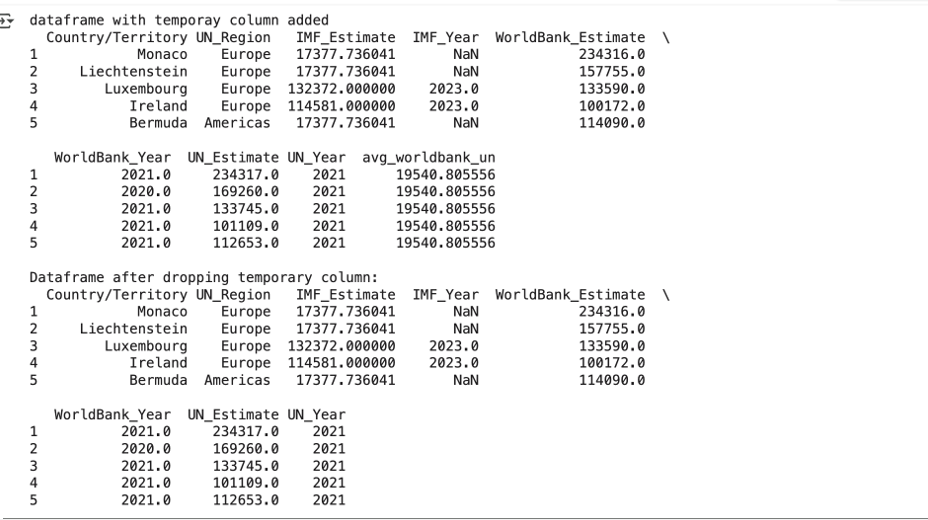

# bootcamp_portfolio
## 🎓 Data Science & Business Intelligence Bootcamp Portfolio

---

This repository showcases projects completed during an intensive **Data Science and Business Intelligence bootcamp**. It demonstrates proficiency across the entire data lifecycle, from querying and cleaning to advanced visualization and cloud architecture.

### 🔑 Core Skills & Projects

The projects highlight hands-on experience with industry-standard tools across four key areas:

| Category | Project Focus | Key Tools/Languages |
| :--- | :--- | :--- |
| **Data Visualization & BI** | Creating executive-level dashboards for **Sales Performance** (Power BI) and **Global Health Metrics** (Tableau) and **HR Analytics** (Tableau). | Power BI, Tableau |
| **Data Wrangling & Analysis** | Cleaning and transforming complex data, including calculating averages from multiple sources and performing advanced data manipulation. | Python (Pandas) |
| **Database & Querying** | Designing and executing efficient **SQL queries** for relational databases, demonstrated by joining tables to rank world capitals by population. | SQL |
| **Cloud & Data Architecture** | Managing and organizing non-relational data, including setting up and securing **Blob Storage Containers** in a cloud environment. | Microsoft Azure |

This portfolio confirms a versatile and practical skill set for driving data-informed decisions across multiple business domains.

## 🎓 Data Science Bootcamp Project Portfolio

---

This repository documents the key projects completed during my intensive data science bootcamp, showcasing proficiency across the entire data lifecycle using industry-standard tools.

### 1. Excel Sales Performance Pivot Table

**Summary:**
* This pivot table summarizes **sales performance** by region and product category.
* Key metrics include **total revenue** and **average order value**, providing a foundational view for sales analysis.

**Skills:**
While Excel is familiar, moving from basic data entry to using a Pivot Table for complex financial aggregation was a necessary step that required practice. I learned that quickly creating annual summaries for Revenue and Profit is a prerequisite for any deeper analysis. Repetition cemented my understanding of how Pivot Tables structure data, and I enjoyed the rapid efficiency of using this foundational tool to prepare data for more advanced BI environments.

---

### 2. Tableau Global Health Metrics Dashboard

**Summary:**
* This project presents a data visualization dashboard exploring various **global health metrics**.
* It offers comparative insights into **BMI, life expectancy, and liver cancer rates** across continents.

**Skills:** 
Choosing the correct visualization type for global health data was a challenge; knowing whether to use a line chart, scatter plot, or a table for specific data points required experimentation. I practiced creating the same visual with different chart types until I could confidently select the one that best conveyed the message (e.g., using a scatter plot for correlation). After this repetition, I found I enjoyed the creative freedom and analytical power of Tableau to compare complex trends like BMI and liver cancer rates across the world.

---

### 3. Power BI Sales Target Dashboard

**Summary:**
* This repository contains a Power BI dashboard designed to track, analyze, and visualize **sales performance metrics** against defined targets.
* It highlights executive KPIs, including **variance** and **variance margin**, for real-time business monitoring.

**Skills:**
The initial difficulty in Power BI was less about the visuals and more about mastering DAX (Data Analysis Expressions) for calculated measures like Variance and Variance Margin. The measures didn't work correctly until I had repeated the formula structure many times. Once I had those foundational DAX skills down, the visualization phase was incredibly satisfying. I truly enjoyed seeing the data come alive and transforming raw numbers into an actionable, professional dashboard that tells a clear story about sales performance against targets.

---

### 4. Azure Non-Relational Data Management

**Summary:**
* This project documents and explores the management of **non-relational data** using **Microsoft Azure Storage Accounts**.
* It specifically focuses on securing and organizing data within **Blob Storage Containers**.

**Skills:** 
The cloud environment felt overwhelming at first due to the sheer number of services and security concepts like Access Control (IAM). The key to learning was the repetition of navigating the Azure portal and setting up the resource hierarchy (Storage Account $\rightarrow$ Container). Once I established a routine for managing non-relational data in Blob Storage and understood the basic security principles, I found I enjoyed grasping this essential, foundational layer of the modern data stack.

---

* ### 5. SQL Database Query Project: World Capital Population Analysis

**Summary:**
* This project contains **SQL scripts** designed to analyze global demographic data from a relational database.
* The core query uses **JOINs** and **ORDER BY** clauses to accurately rank capital cities by population (e.g., Seoul, Jakarta, Moscow).

**Skills:** 
Writing correct SQL JOINs was a major challenge early on; getting the primary and foreign keys to line up correctly required careful attention. I overcame this by practicing different types of JOINs repeatedly until I instinctively knew the correct logic for linking tables. This effort paid off immensely, and I now enjoy the ability to write precise, powerful queries that extract exactly the data needed—like ranking world capitals confirming that the hard work of repetition truly leads to mastery.

---

### 6. Python Data Cleaning and Feature Engineering

**Summary:**
* This repository houses a **Jupyter Notebook** demonstrating key data manipulation and cleaning techniques using the **Pandas** library.
* The script focuses on **feature engineering** by calculating a robust average across multiple economic estimates (IMF, World Bank, UN).

**Skills:** 
Python programming, data cleaning, handling NaN values, and feature engineering for analysis readiness.
Learning the precise syntax of the Pandas library was the steepest initial hurdle. Commands for things like feature engineering and properly handling missing values (NaN) felt unintuitive at the start. But by running and modifying the code repeatedly, I began to see the logic in how DataFrames are manipulated. This repetition led to confidence, and I came to enjoy the methodical, powerful process of using Python to efficiently clean, transform, and prepare data for advanced analysis.
