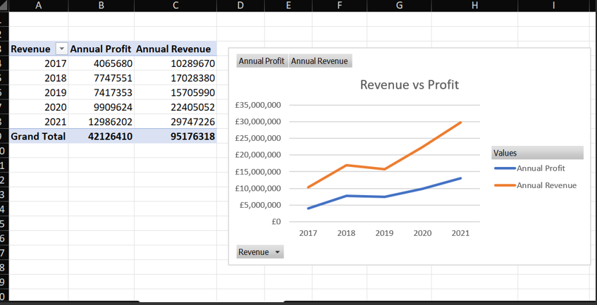
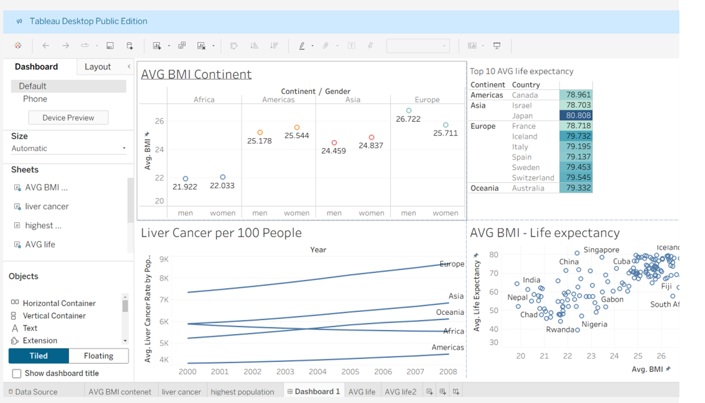
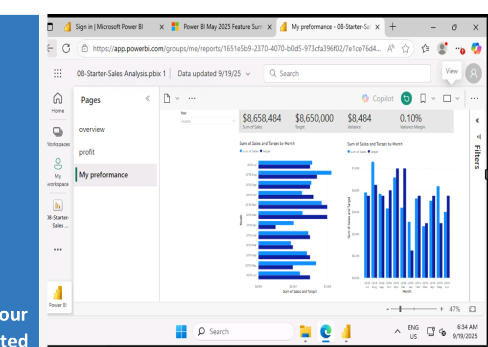
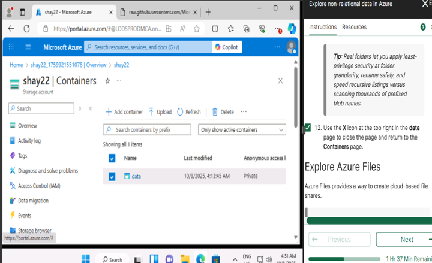
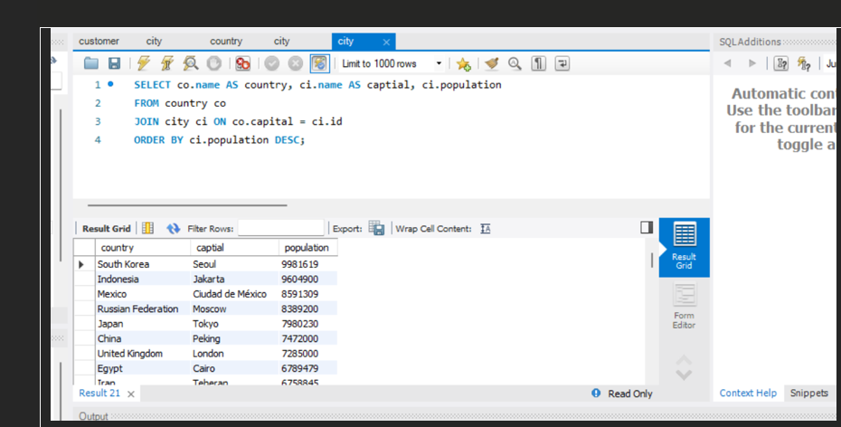

# bootcamp_portfolio

**Summary:**
This pivot table summarizes sales preformances by region and product category, showing total revenue, average order value, and growth trends.

**Summary:**
This repository presents a data visualization dashboard exploring various global health metrics, designed to offer comparative insights into population health factors across continents and countries. The dashboard utilizes public health data to visualize trends in body mass index (BMI), life expectancy, and liver cancer rates.

**Summary:**
This repository contains a Power BI dashboard designed to track, analyze, and visualize sales performance metrics against defined targets. The dashboard focuses on key performance indicators KPIs to provide a clear, month-by-month understanding of business execution and variance.

**Summary:**
This repository documents and explores the management of non-relational data using Microsoft Azure Storage Accounts, specifically focusing on Blob Storage Containers. The project highlights best practices for data organization, security, and access within the Azure ecosystem.

**Summary:**
This repository contains SQL scripts and documentation related to a database query project focused on analyzing global demographic data. The primary goal of this script is to identify and rank the largest capital cities by population across various countries.
